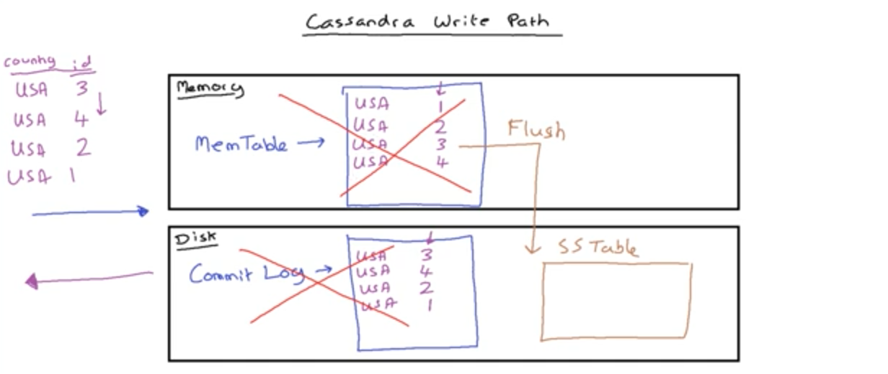
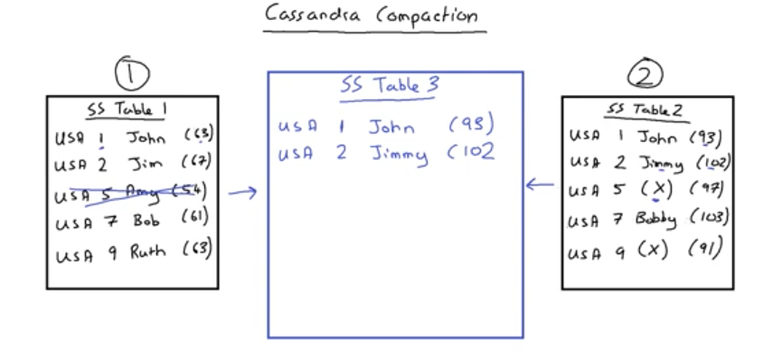

# Cassandra Paths

Let's understand write and read paths along with Compaction in Cassandra

[Write Path](#write-path)

[Read Path](#read-path)

[Compaction](#compaction)

<h3 id="write-path">Write Path</h3>

Cassandra runs on JVM. It has access to the memory (MemTable) and the physical storage/disk  (Commit Log). When a write is requested by the client, Cassandra writes the data to both the `Commit Log` and `MemTable`. The difference is: `Commit Log` table doesn't have the sorted order of data based on the clustering index, but the MemTable does have the sorted order as it can be seen in the image below.

When MemTable and CommitLog grow as the data is written, MemTable data gets flused to an immutable table, called `SS Table` on the disk. Both MemTable and CommitLog get flushed and this same process continues. In the end, there are a lot of SS Tables on the disk, which also get combined into a few SS tables using the process called `Compaction`.

<h3 id="read-path">Read Path</h3>

As you can see, the data is in multiple places as below. The data from MemTable is newer so the data will be returned from MemTable, if the same key exists but older data in other tables.

How does Cassadra get the data from multiple tables while reading?
* Cassadra saves info on nodes based on the partition key. It checks `bloom filter` to know SS table that the data is present. `Key Cache` stores frequently accesses indexes. `Partition Summary` helps when `Partition Index` grows in size. It groups indexes together (3-4 partition keys in one group, a quicker way to get first few nodes instead of scanning all.   `Partitin Index` has the information on partition and node/SS Table where the data is present. Finally reading from `SS Table`.. This is not the most performant one.

<h3 id="compaction">Compaction</h3>

* Compaction: Consolidates multiple SS tables into One SS Table to ensure the data effiency and good read speeds. Better to have the data in one ss table. SS Tables are immutable, i.e. we can not change a SS table, instead we can create new ones.

**Partition Key Name (Timestamp)**

Make a note.... SS table on the right has `USA 5 X ` with the latest timestamp. That means it was deleted by the user so this row wont be written to final SS table

**The merge happens in Memory and gets flushed to another SS table on the disk**

